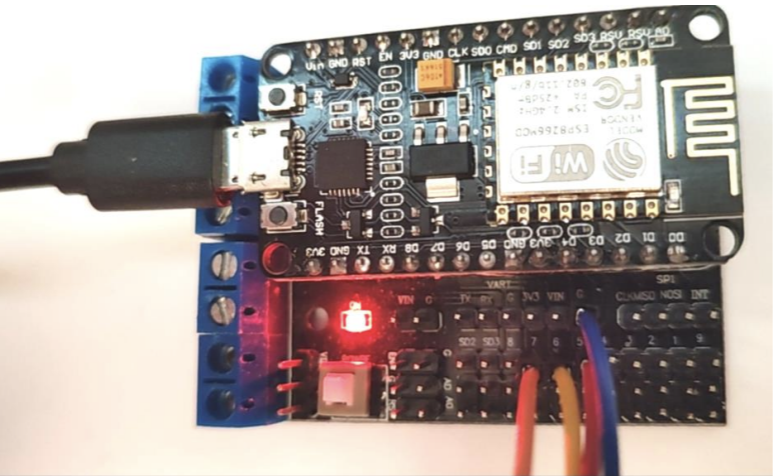
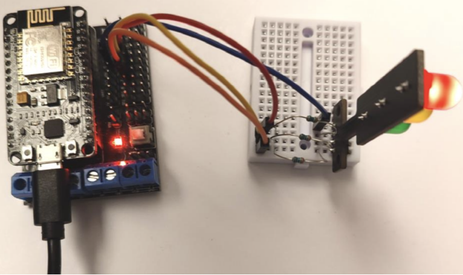

# Övning 1 – Trafikljus med ESP8266

I den här övningen kopplar du ett trafikljus (tre lysdioder: grön, gul och röd) till en ESP8266 och programmerar det så att det växlar färg precis som ett riktigt trafikljus.

## Mål

När du är klar ska du kunna:

- koppla komponenter på en experimentplatta (breadboard)
- förklara varför lysdioder behöver en resistor i serie
- använda `pinMode()`, `digitalWrite()` och `delay()`
- ladda upp ett program till ESP8266 från Arduino-mjukvaran

## Material

- 1 st ESP8266 (NodeMCU) på expansionskort
- 1 st USB-kabel (data)
- 1 st trafikljusmodul märkt **G, Y, R** och **GND**
- 1 st experimentplatta (breadboard)
- 3 st resistorer (t.ex. 220 Ω)
- 4 st kopplingskablar

> Har du inte installerat Arduino-mjukvaran och stödet för ESP8266 än? Följ först avsnittet *Installera Arduino-miljön för ESP8266* i [ESP8266-guiden](../README.md).

## Så här ser uppställningen ut

**Bild 1** – Kablarna kopplas till stiften märkta **7**, **6**, **5** och **G** på expansionskortet.



**Bild 2** – Hela uppställningen med experimentplattan, de tre resistorerna och trafikljuset.



---

## Steg 1 – Koppla in trafikljuset

### Vad betyder märkningen?

Trafikljuset är märkt med **G, Y, R** och **GND**:

| Märkning | Engelska | Svenska |
|----------|----------|---------|
| G        | Green    | Grön    |
| Y        | Yellow   | Gul     |
| R        | Red      | Röd     |
| GND      | Ground   | Jord    |

Bredvid ESP8266 finns det många metallstift som sticker upp. Vi ska använda stiften **7**, **6**, **5** och **G**.

**D** står för *digital*, det vill säga att stiftet antingen har **låg** (`LOW`) eller **hög** (`HIGH`) spänningsnivå jämfört med jord (ground). Därför heter stiften `D5`, `D6` och `D7` i koden.

### Kopplingsschema

Koppla in trafikljuset på experimentplattan **i serie med en resistor** för varje färg:

| Trafikljus | Via             | ESP8266-stift |
|------------|-----------------|---------------|
| G (grön)   | resistor        | **D7**        |
| Y (gul)    | resistor        | **D6**        |
| R (röd)    | resistor        | **D5**        |
| GND        | direkt (ingen resistor) | **G** (ground) |

```
ESP8266                 Experimentplatta              Trafikljus
                                                      
  D7 ──────────────────┤ resistor ├────────────────── G
  D6 ──────────────────┤ resistor ├────────────────── Y
  D5 ──────────────────┤ resistor ├────────────────── R
  G  ─────────────────────────────────────────────── GND
```

### Tänk på experimentplattan

Hålen på experimentplattan har **elektrisk kontakt med varandra i grupper om fem hål**. Det betyder:

- En kabel och ett resistorben som sitter i **samma femhålsgrupp** är ihopkopplade.
- Resistorns två ben måste sitta i **olika** grupper – annars kortsluts den och gör ingen nytta.
- Varje färg ska ha **sina egna** grupper så att de inte kopplas ihop med varandra.

### Varför behövs resistorerna?

En lysdiod släpper igenom nästan hur mycket ström som helst när den väl lyser. Utan resistor kan det gå så mycket ström att lysdioden eller ESP8266-stiftet går sönder. Resistorn **begränsar strömmen**.

> **Kontrollera kopplingen innan du kopplar in USB-kabeln!** Följ varje kabel med fingret från ESP8266 till trafikljuset.

---

## Steg 2 – Ladda upp koden

1. Koppla ESP8266 till datorn med USB-kabeln.
2. Öppna Arduino-mjukvaran och skapa en ny skiss.
3. Kontrollera att rätt kort (t.ex. *NodeMCU 1.0 (ESP-12E Module)*) och rätt port är valda under **Tools**.
4. Klistra in koden nedan.
5. Ladda upp koden genom att trycka på **högerpilen** (Upload) uppe till vänster i Arduino-mjukvaran.

```cpp
const byte redLight = D5;
const byte amberLight = D6;
const byte greenLight = D7;

void setup() {
  pinMode(redLight, OUTPUT);
  pinMode(amberLight, OUTPUT);
  pinMode(greenLight, OUTPUT);

  digitalWrite(redLight, LOW);
  digitalWrite(amberLight, LOW);
  digitalWrite(greenLight, LOW);
}

void loop() {
  digitalWrite(redLight, HIGH);
  delay(3000);

  digitalWrite(amberLight, HIGH);
  delay(1000);

  digitalWrite(redLight, LOW);
  digitalWrite(amberLight, LOW);
  digitalWrite(greenLight, HIGH);
  delay(5000);

  digitalWrite(greenLight, LOW);
  digitalWrite(amberLight, HIGH);
  delay(2000);

  digitalWrite(amberLight, LOW);
}
```

När uppladdningen är klar ska trafikljuset börja växla färg.

---

## Så fungerar koden

### Konstanterna

```cpp
const byte redLight = D5;
```

Vi ger stiften namn så att koden blir lättare att läsa. `amber` betyder bärnstensfärgad – det är det engelska ordet för den gula färgen i ett trafikljus.

### setup()

Körs **en gång** när ESP8266 startar:

- `pinMode(..., OUTPUT)` talar om att stiftet ska **skicka ut** spänning (inte läsa in).
- `digitalWrite(..., LOW)` ser till att alla lampor är släckta från början.

### loop()

Körs **om och om igen**. `digitalWrite(..., HIGH)` tänder en lampa, `LOW` släcker den och `delay(3000)` väntar i 3000 millisekunder (= 3 sekunder).

| Fas | Röd | Gul | Grön | Tid   | Betydelse         |
|-----|:---:|:---:|:----:|-------|-------------------|
| 1   | ●   |     |      | 3 s   | Stopp             |
| 2   | ●   | ●   |      | 1 s   | Gör dig redo      |
| 3   |     |     | ●    | 5 s   | Kör               |
| 4   |     | ●   |      | 2 s   | Stanna om du kan  |

Sedan börjar `loop()` om från fas 1.

---

## Felsökning

| Problem | Möjlig orsak |
|---------|--------------|
| Ingen lampa lyser | GND inte kopplad till G, eller koden laddades inte upp. |
| En lampa lyser aldrig | Kabeln sitter i fel stift, eller resistorns ben sitter i samma femhålsgrupp. |
| Fel färg lyser vid fel tid | G/Y/R har kopplats till fel stift – jämför med kopplingstabellen. |
| Uppladdningen misslyckas | Fel kort eller port vald under **Tools**, eller USB-kabeln klarar bara laddning (inte data). |

---

## Extrauppgifter

1. **Ändra tiderna** – låt det vara grönt i 10 sekunder och rött i 8 sekunder.
2. **Blinkande gult** – skriv ett program där bara den gula lampan blinkar en gång per sekund, som ett trafikljus nattetid.
3. **Egen funktion** – skapa en funktion `void visaLjus(bool rod, bool gul, bool gron, int tid)` som tänder rätt lampor och väntar. Skriv om `loop()` så att den bara består av fyra anrop till din funktion.
